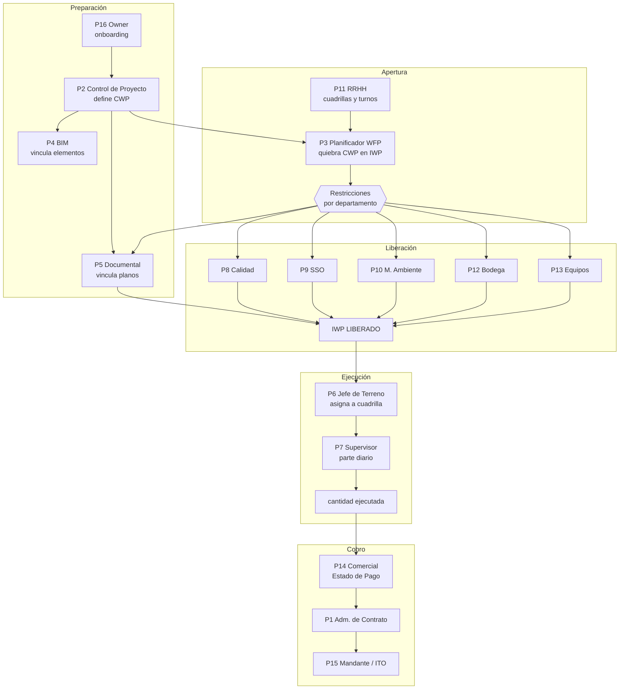

# Historias de Usuario — Hilo Digital

> **Estado:** borrador para revisión del dueño y del equipo de desarrollo.
> **Fecha:** 2026-08-08. Medido contra la base `lsoesbsrlfingfckozsq` y el código en `master`.
> **Documento hermano:** [`MODELO_DATOS.md`](MODELO_DATOS.md) — cada historia de aquí apunta a
> las entidades de allá. Los dos se leen juntos o ninguno sirve.

---

## 0. Cómo leer este documento

Sirve a tres lectores distintos, y cada uno mira una parte:

| Lector | Qué mira | Dónde |
|---|---|---|
| **Equipo de desarrollo** | El identificador, los criterios de aceptación y las entidades que toca cada historia. Es el backlog. | §3 (bloques *Historias*) y §5 |
| **CORFO / CENIA** | El recorrido de cada persona y el indicador que mueve. Es la evidencia de que el producto resuelve un problema real y medible. | §1, §2, §3 (bloques *Recorrido* e *Indicador*) y §6 |
| **Cliente / mandante** | El dolor actual de cada departamento y qué gana al entrar. Es la propuesta de valor por rol. | §1, §2 y §3 (bloques *Dolor hoy*) |

**Convención de estado** en cada historia:

- ✅ **Implementado** — existe y funciona con datos reales.
- 🟡 **Parcial** — hay pantalla o API, pero le falta algo nombrado explícitamente.
- ⬜ **Falta** — no existe. Es backlog puro.

**Convención de identificador:** `HU-<PERSONA>-<n>`. El prefijo no cambia nunca aunque la
historia se reescriba: es lo que permite trazarla al commit, al test y a la entidad.

---

## 1. El mapa de personas

Las personas **no son los roles técnicos**. Confundirlos produce historias inútiles del tipo
*"como admin quiero administrar"*. Son dos ejes independientes:

- **Persona** = a qué viene a la plataforma. Es funcional, hay ~16, y define el backlog.
- **Rol técnico** = qué puede tocar. Hoy son 3 (`admin`, `editor`, `viewer` del enum
  `project_role`), define una matriz de permisos, y **no genera historias**.

La lista de personas no se inventó: ya está escrita en la base en el enum `tidp_discipline`
(Oficina Técnica, Terreno, Calidad, Medio Ambiente, Prevención de Riesgos, Equipos, Recursos
Humanos, Administración, Contratos, Bodega, Topografía, Laboratorio) y en la columna *Dueño
funcional* de [`ARQUITECTURA_SERVICIOS.md`](ARQUITECTURA_SERVICIOS.md) §4. Este documento las
usa como están.

| # | Persona | Departamento (TIDP) | Servicio dueño | Módulos que usa | Estado de su experiencia |
|---|---|---|---|---|---|
| **P1** | Administrador de Contrato | Contratos | — (consume todo) | `panel`, `estado-pago`, `conciliacion` | 🟡 |
| **P2** | Control de Proyecto (AWP) | Oficina Técnica | `awp` | `mineria`, `planificacion`, `conciliacion` | ✅ |
| **P3** | Planificador WFP | Oficina Técnica | `ejecucion` | `apertura`, `trisemanal`, `recursos` | ✅ |
| **P4** | Coordinador BIM | Oficina Técnica | `bim` | `mineria/elementos`, `mineria/atributos`, `sistemas` | ✅ |
| **P5** | Control Documental | Oficina Técnica | `documental` | `mineria/documentos`, `calidad` | 🟡 |
| **P6** | Jefe de Terreno | Terreno | `ejecucion` | `apertura`, `trisemanal`, `panel` | 🟡 |
| **P7** | Supervisor de cuadrilla | Terreno | `ejecucion` | *(parte diario móvil)* | ⬜ **no existe** |
| **P8** | Jefe de Calidad | Calidad | `calidad` | `calidad` | 🟡 |
| **P9** | Prevencionista | Prevención de Riesgos | `sso` | `sso` | 🟡 |
| **P10** | Encargado Medio Ambiente | Medio Ambiente | `medioambiente` | `medio-ambiente` | 🟡 |
| **P11** | Administrador de Obra / RRHH | Recursos Humanos | `recursos` | `recursos`, `recursos/cuadrillas`, `rrhh` | ✅ |
| **P12** | Abastecimiento / Bodega | Bodega | `suministros` | — | ⬜ **sin módulo** |
| **P13** | Jefe de Equipos | Equipos | `equipos` | `equipos` | 🟡 |
| **P14** | Comercial / Estado de Pago | Administración | `comercial` | `estado-pago` | 🟡 |
| **P15** | **Mandante / ITO** | *(otra organización)* | — | *(vista de lectura)* | ⬜ **no modelado** |
| **P16** | Owner de plataforma (EI) | — | — | `setup`, `onboarding`, `miembros`, `portafolio` | ✅ |

*Topografía* y *Laboratorio* existen en el enum pero no tienen alcance en el producto actual.
Se dejan declarados para no reabrir el vocabulario cuando aparezcan.

---

## 2. El ciclo que une a todas las personas

Ninguna persona trabaja sola. La plataforma vale porque **el trabajo de una es el insumo de la
siguiente**, y la llave que los une es el **CWP**. Este es el ciclo completo:



**Las tres roturas del ciclo hoy** — y son exactamente las tres personas marcadas ⬜:

1. **P7 no tiene por dónde entrar.** Es el usuario más numeroso de todos (un supervisor por
   cuadrilla, 61 cuadrillas sembradas) y el único sin interfaz. Sin él, `cantidad_ejecutada`
   nunca se llena y el Estado de Pago sigue calculándose fuera de la plataforma.
2. **P12 no tiene módulo.** `mining_suministro` existe con 95 filas, pero MATERIAL es una de
   las tres restricciones críticas del estándar COAA. La restricción se levanta y nadie del
   otro lado la puede cerrar.
3. **P15 no está modelado.** Es de otra organización; `projects` cuelga de un solo
   `organization_id`. Ver §6.

---

## 3. Historias por persona

---

### P1 — Administrador de Contrato

> **Recorrido.** Entra una vez al día y quiere una sola respuesta: *¿el proyecto avanza como se
> comprometió, y si no, quién lo está frenando?* No navega módulos: mira el panel, ve una cifra
> que no le gusta, y baja hasta el nombre del departamento responsable.

**Dolor hoy.** El avance se arma juntando cuatro planillas de cuatro personas distintas, cada
una con su corte de fecha. Cuando el mandante pregunta por una cifra, la respuesta tarda dos
días y no siempre coincide con la anterior.

**Indicador que mueve.** Tiempo desde la pregunta hasta la cifra defendible: de días a minutos.

| ID | Historia | Estado |
|---|---|---|
| **HU-CON-01** | Como Administrador de Contrato quiero ver en una pantalla el avance físico, el avance de apertura WFP y las restricciones críticas vencidas, para saber en 30 segundos si el proyecto está sano. | ✅ |
| **HU-CON-02** | Como Administrador de Contrato quiero que cada cifra del panel me diga con qué versión de qué servicio se calculó, para poder defenderla ante el mandante. | ⬜ |
| **HU-CON-03** | Como Administrador de Contrato quiero un ranking de departamentos por restricciones vencidas a su cargo, para escalar a la persona correcta y no al proyecto entero. | ⬜ |
| **HU-CON-04** | Como Administrador de Contrato quiero comparar mis proyectos entre sí, para mover recursos del que sobra al que falta. | 🟡 |

**Criterios de aceptación — HU-CON-02**

```gherkin
Dado que el Estado de Pago del período 2026-07 fue calculado
Cuando abro la cifra de avance físico
Entonces veo "itemizado v3 · recursos v7 · avance v12" junto al monto
Y al pinchar cada insumo veo quién publicó esa versión y cuándo
```
Entidades: `calculo_lineage`, `servicio_version`.
Nota: la tabla `calculo_lineage` **ya existe y está vacía** — ningún cálculo la escribe todavía.
Es la regla 7 de `ARQUITECTURA_SERVICIOS.md` §11, declarada y no cumplida.

**Criterios de aceptación — HU-CON-03**

```gherkin
Dado que existen restricciones abiertas en IWP del proyecto
Cuando abro el tablero de escalamiento
Entonces veo una fila por departamento con: abiertas, vencidas, días de atraso promedio
Y las críticas del estándar COAA (INGENIERIA, MATERIAL, ANDAMIO) van primero
Y puedo pinchar una fila y ver los IWP que esa restricción está frenando
```
Entidades: `mining_iwp_constraint`, `mining_iwp`. Catálogo: `src/lib/constraints.ts` (`depto`, `critica`).

---

### P2 — Control de Proyecto (AWP)

> **Recorrido.** Es el dueño de la estructura. Define el desglose CWA → CV → CWP, carga el
> programa contractual y el itemizado, y responde por que el paquete que todos usan como llave
> signifique lo mismo para todos. Su pantalla es el explorador CWP.

**Dolor hoy.** El desglose vive en un Excel maestro que él controla. Cada vez que cambia, tiene
que avisar por correo a cinco personas y ninguna versión coincide con la otra.

**Indicador que mueve.** Cobertura del cruce programa ↔ itemizado ↔ modelo. En Collahuasi hoy:
159 CWP, 1.172 actividades de programa, 2.524 líneas de itemizado.

| ID | Historia | Estado |
|---|---|---|
| **HU-AWP-01** | Como Control de Proyecto quiero explorar el árbol CWA → CV → CWP y ver de cada paquete su alcance, programa, planos y elementos 3D, para verificar que el paquete está completo antes de entregarlo a planificación. | ✅ |
| **HU-AWP-02** | Como Control de Proyecto quiero un tablero de salud de los cruces que me diga qué CWP tienen itemizado sin programa, programa sin modelo o modelo sin documentos, para cerrar las brechas antes de que las descubra terreno. | ✅ |
| **HU-AWP-03** | Como Control de Proyecto quiero cargar una revisión nueva del programa sin destruir la anterior, para poder comparar y explicar qué se movió. | ⬜ |
| **HU-AWP-04** | Como Control de Proyecto quiero publicar el catálogo de CWP como versión oficial, para que nadie planifique sobre un desglose que todavía estoy editando. | ⬜ |
| **HU-AWP-05** | Como Control de Proyecto quiero ver el banco de cantidades de un CWP con su saldo no aperturado, para saber cuánto alcance queda por comprometer. | ✅ |

**Criterios de aceptación — HU-AWP-03**

```gherkin
Dado que el proyecto tiene el programa P333 revisión 4 vigente
Cuando cargo el archivo de la revisión 5
Entonces se crea una versión draft del servicio awp
Y la revisión 4 sigue siendo la vigente para todos los consumidores
Y veo un comparador: actividades nuevas, eliminadas y con fecha corrida
Cuando publico la revisión 5
Entonces los consumidores pasan a leerla y la 4 queda consultable
```
Entidades: `mining_programa`, `servicio_version`, `servicio_evento`.
Bloqueo conocido: `mining_programa` **no tiene `version_id`** todavía (solo 2 de 56 tablas
`mining_*` lo tienen). Es la Etapa 3 de `ARQUITECTURA_SERVICIOS.md` §12.

---

### P3 — Planificador WFP

> **Recorrido.** Es la persona para la que se construyó el producto. Cada semana toma los CWP
> que el programa pide arrancar, decide cuáles se pueden quebrar, y en la Mesa de Trabajo los
> parte en IWP del tamaño que una cuadrilla cierra en un ciclo de turno. Es una sesión de Pull
> Planning: prueba, descarta, fusiona, divide y vuelve atrás.

**Dolor hoy.** El quiebre se hace en Excel a mano. Cuesta medio día por CWP, no queda registro
de por qué se cortó así, y si cambia la dotación hay que rehacerlo todo.

**Indicador que mueve.** **% de apertura del proyecto.** Hoy en Collahuasi: **0%** — 98 CWP con
banco completo y ninguno quebrado. Es la cifra que este módulo existe para mover.

| ID | Historia | Estado |
|---|---|---|
| **HU-WFP-01** | Como Planificador WFP quiero un ranking de CWP por urgencia con semáforo de aperturabilidad, para saber cuál abrir esta semana y qué le falta a los que no puedo. | ✅ |
| **HU-WFP-02** | Como Planificador WFP quiero quebrar un CWP en paquetes parejos definiendo cuadrilla, turno y factor de productividad, para que el TAKT sea constante y no queden colas. | ✅ |
| **HU-WFP-03** | Como Planificador WFP quiero editar un paquete a mano y que al regenerar con otros parámetros ese paquete se conserve y su alcance se descuente del saldo, para no perder media hora de refinamiento. | ✅ |
| **HU-WFP-04** | Como Planificador WFP quiero que mi borrador viva en la base y no en el navegador, para que sobreviva al reload y para que la otra persona en la misma sesión vea lo mismo que yo. | ✅ |
| **HU-WFP-05** | Como Planificador WFP quiero que al publicar los paquetes se les siembren las restricciones sugeridas por departamento, para que la bandeja de cada uno se llene sola. | ✅ |
| **HU-WFP-06** | Como Planificador WFP quiero un Release Plan de 6 semanas que muestre qué IWP estarán liberados cuándo, para comprometer frentes con terreno. | ⬜ |
| **HU-WFP-07** | Como Planificador WFP quiero simular qué pasa con el plan si una restricción crítica se atrasa 2 semanas, para negociar con el departamento con un número en la mano. | ⬜ |

**Criterios de aceptación — HU-WFP-02**

```gherkin
Dado un CWP con 55.606 HH de banco y saldo completo
Y una cuadrilla de 12 personas en turno 7x7 con factor 0,85
Cuando genero la propuesta de quiebre
Entonces se crean ceil(total / objetivo) paquetes de tamaño parejo
Y ningún paquete queda con menos de la mitad del objetivo
Y la suma de las partidas de todos los paquetes iguala el banco del CWP
Y el preview del cliente y la validación del servidor dan el mismo resultado
```
Entidades: `mining_apertura_sesion`, `mining_iwp_borrador`, `mining_cuadrilla`, `mining_turno`,
`v_cwp_banco`. Motor: `src/lib/iwp-apertura.ts` (compartido cliente/servidor — es lo que
garantiza el último criterio).

**Criterios de aceptación — HU-WFP-06**

```gherkin
Dado el conjunto de IWP en estado PLANIFICADO y LISTO_PARA_TRABAJO
Cuando abro el Release Plan
Entonces veo 6 columnas semanales en formato ISO (2026-W31)
Y cada IWP cae en la semana en que su última restricción crítica vence
Y los que no tienen fecha comprometida en ninguna restricción salen marcados aparte
```
Nota de diseño: una restricción sin fecha no es "no urgente", es peor — nadie se hizo cargo.
`diasParaVencer()` en `src/lib/constraints.ts` ya devuelve `null` para ese caso a propósito.

---

### P4 — Coordinador BIM

> **Recorrido.** Responde por que el modelo sea utilizable como fuente de cantidades y de
> alcance, no solo como dibujo. Vincula elementos a CWP, revisa qué atributos del Anexo 7 están
> llenos y le devuelve al modelador la lista de lo que falta.

**Dolor hoy.** La conformidad del modelo se audita a mano contra un PDF de 90 atributos. Nadie
distingue *"la plataforma no guarda ese dato"* de *"el modelador no lo llenó"*, así que todos
los informes dan 100% o dan pena, y ninguno de los dos sirve.

**Indicador que mueve.** Llenado del modelo por atributo exigido. Medido en Collahuasi al
2026-08-06, etapa Construcción: **97 atributos exigidos, 26 los guarda Hilo (26,8%), llenado
45,3%**.

| ID | Historia | Estado |
|---|---|---|
| **HU-BIM-01** | Como Coordinador BIM quiero ver el modelo 3D filtrado por CWP y pintar por estado, para verificar visualmente que el paquete contiene lo que dice contener. | ✅ |
| **HU-BIM-02** | Como Coordinador BIM quiero un informe de conformidad Anexo 7 que separe *cobertura del catálogo* de *llenado del modelo*, para saber cuál brecha es mía y cuál del modelador. | ✅ |
| **HU-BIM-03** | Como Coordinador BIM quiero corregir el CWP de un grupo de elementos y que quede registrado quién lo cambió y cuándo, para poder revertir una asignación equivocada. | 🟡 |
| **HU-BIM-04** | Como Coordinador BIM quiero cargar un modelo nuevo desde APS sin pasar por un script, para no depender de un desarrollador en cada revisión. | ⬜ |
| **HU-BIM-05** | Como Coordinador BIM quiero exportar la lista de elementos sin atributo obligatorio agrupada por responsable, para mandarla como observación formal al modelador. | ⬜ |

**Sobre HU-BIM-03 (por qué es 🟡).** `mining_cambios_log` tiene **178.532 filas** de auditoría,
pero ninguna persona tiene pantalla para leerla, y de las 56 tablas `mining_*` solo **2 tienen
`updated_by`** y **ninguna tiene `created_by`**. El dato existe, el responsable no. Ver
`MODELO_DATOS.md` §7.

**Criterios de aceptación — HU-BIM-04**

```gherkin
Dado que tengo un URN de un modelo traducido en APS
Cuando lo registro en el proyecto desde la interfaz
Entonces la plataforma extrae las propiedades y crea los elementos
Y deduce el CWP del árbol del modelo como primera pasada
Y me muestra cuántos elementos quedaron sin CWP antes de confirmar
```
Precedente: hoy esto lo hacen `scripts/aps-vincular-sp3d.mjs` y `sp3d-4d-vincular.mjs` a mano.
Regla del proyecto: **todo modelo entra por APS**, nunca por export manual.

---

### P5 — Control Documental

> **Recorrido.** Es el guardián del gate de liberación. Un IWP no se libera si sus planos no
> están emitidos para construcción, y esa palabra —*Emitido para construcción*, el `Estatus` de
> Aconex— es suya.

**Dolor hoy.** El estado de un documento vive en Aconex, el paquete al que sirve vive en un
Excel, y nadie sabe qué IWP se cae si un plano se atrasa hasta que terreno llega al frente.

**Indicador que mueve.** % de documentos con estado del ciclo de vida conocido. En Collahuasi
pasó de **0 a 842 de 902 documentos** con la carga del 2026-08-04.

| ID | Historia | Estado |
|---|---|---|
| **HU-DOC-01** | Como Control Documental quiero ver los documentos del proyecto con su estado de ciclo de vida y el CWP al que sirven, para saber qué falta emitir. | ✅ |
| **HU-DOC-02** | Como Control Documental quiero abrir el PDF desde la ficha del paquete, para no buscar en carpetas de red. | 🟡 |
| **HU-DOC-03** | Como Control Documental quiero ver qué IWP están bloqueados por un documento mío, para priorizar la emisión por impacto en obra y no por fecha de solicitud. | ⬜ |
| **HU-DOC-04** | Como Control Documental quiero que al cambiar un documento a IFC se cierre sola la restricción INGENIERIA de los IWP que lo esperaban, para no cerrarlas a mano una por una. | ⬜ |

**Sobre HU-DOC-02 (por qué es 🟡).** Se sirven **solo `.pdf`** desde `ACONEX_DOCS_DIR`. En el
Puerto hay **108 planos que en Aconex existen únicamente como DWG, 36 de ellos emitidos para
construcción**, y desde la plataforma no se pueden abrir. Cobertura actual: 786 de 902 (87%).

**Criterios de aceptación — HU-DOC-04**

```gherkin
Dado un IWP con una restricción INGENIERIA abierta que referencia el documento D-1234
Cuando el estado de D-1234 pasa a "Emitido para construcción"
Entonces la restricción se cierra automáticamente y registra el origen del cierre
Y si era la última pendiente, el servidor sube el IWP a LISTO_PARA_TRABAJO
Y el planificador ve el cambio sin recargar
```
Regla dura: **`LISTO_PARA_TRABAJO` lo calcula el servidor, nunca una persona**. Declararlo a
mano sería mentirle al backlog. Ver `src/lib/iwp-estado.ts`.

---

### P6 — Jefe de Terreno

> **Recorrido.** Recibe los IWP liberados, los reparte entre sus cuadrillas y responde por que
> el frente no se detenga. Su pregunta diaria es *¿qué puedo empezar mañana y qué me van a
> frenar?*

**Dolor hoy.** Se entera de que falta un andamio o un permiso cuando la cuadrilla ya está
parada en el frente. El costo de esa hora no queda registrado en ninguna parte.

**Indicador que mueve.** % de IWP liberados sobre IWP planificados a 3 semanas — el indicador
clásico de WorkFace Planning.

| ID | Historia | Estado |
|---|---|---|
| **HU-TER-01** | Como Jefe de Terreno quiero ver los IWP liberados por disciplina y semana, para armar la carga de mis cuadrillas. | 🟡 |
| **HU-TER-02** | Como Jefe de Terreno quiero asignar un IWP a una cuadrilla concreta con fecha de inicio, para que el supervisor sepa qué le toca. | ⬜ |
| **HU-TER-03** | Como Jefe de Terreno quiero levantar una restricción desde el frente indicando tipo y fecha necesaria, para que le llegue al departamento dueño sin llamar por teléfono. | ✅ |
| **HU-TER-04** | Como Jefe de Terreno quiero ver la ficha del IWP en PDF con alcance, planos, procedimientos y riesgos, para entregársela impresa a la cuadrilla. | ✅ |
| **HU-TER-05** | Como Jefe de Terreno quiero registrar horas perdidas por restricción no cerrada, para que el costo de la espera tenga dueño. | ⬜ |

---

### P7 — Supervisor de cuadrilla ⬜

> **Recorrido (propuesto).** Está en el frente, con casco y guantes, y con un teléfono. Abre el
> IWP que le tocó, marca qué partidas avanzó y cuánto, y si algo lo frenó lo dice ahí mismo.
> Dos minutos al final del turno. No entra a un escritorio nunca.

**Dolor hoy.** El avance se anota en papel, se pasa a Excel en la oficina al día siguiente y se
consolida el lunes. Cuando llega al Estado de Pago tiene una semana de antigüedad y nadie puede
reconstruir de dónde salió cada número.

**Indicador que mueve.** Latencia del dato de avance: de ~7 días a <24 h. Es el indicador con
más impacto de todo el producto, y el único que hoy no se puede mover.

| ID | Historia | Estado |
|---|---|---|
| **HU-SUP-01** | Como Supervisor quiero ver en el teléfono solo los IWP asignados a mi cuadrilla, para no navegar el proyecto entero. | ⬜ |
| **HU-SUP-02** | Como Supervisor quiero marcar cantidad ejecutada por partida del IWP, para que el avance sea del alcance real y no un porcentaje inventado. | ⬜ |
| **HU-SUP-03** | Como Supervisor quiero declarar un impedimento con foto desde el frente, para que quede registrado con hora y ubicación. | ⬜ |
| **HU-SUP-04** | Como Supervisor quiero que el parte funcione sin señal y se sincronice al volver, porque en el frente no hay cobertura. | ⬜ |

**Criterios de aceptación — HU-SUP-02**

```gherkin
Dado un IWP EN_EJECUCION asignado a mi cuadrilla
Cuando registro 12 un ejecutadas de una partida de 40 un
Entonces mining_iwp_partida.cantidad_ejecutada queda en 12
Y el avance del IWP se recalcula como cantidad ejecutada sobre cantidad asignada
Y el registro guarda quién, cuándo y desde qué dispositivo
Y no puedo declarar más cantidad que la asignada al paquete
```
Entidades: `mining_iwp_partida` (**existe, 0 filas**), `mining_iwp_progreso` (existe, 0 filas),
`mining_avance_pasos` (existe, 0 filas).
**Las tres tablas del ciclo de ejecución están creadas y vacías.** El modelo ya previó esto; lo
que falta es la interfaz y el vínculo IWP → cuadrilla de HU-TER-02.

---

### P8 · P9 · P10 — Calidad, Prevención de Riesgos y Medio Ambiente

Se agrupan porque su experiencia es **la misma forma con distinto contenido**: son dueños de un
tipo de restricción, tienen una bandeja, y su trabajo es cerrarla a tiempo. Diseñar tres
pantallas distintas sería un error.

> **Recorrido.** Entra a su bandeja, ve las restricciones de su departamento ordenadas por
> vencimiento e impacto, cierra las que ya resolvió y compromete fecha para las demás.

**Dolor hoy.** Se enteran de lo que se les pide por correo o en la reunión del lunes. No tienen
forma de ver cuántos frentes están frenando, así que priorizan por quien grita más fuerte.

**Indicador que mueve.** Días promedio de cierre de restricción por departamento.

| ID | Historia | Estado |
|---|---|---|
| **HU-DEP-01** | Como responsable de departamento quiero una bandeja con las restricciones de mi tipo, ordenadas por vencidas primero, para saber qué cerrar hoy. | 🟡 |
| **HU-DEP-02** | Como responsable de departamento quiero ver cuántos IWP y cuántas HH está frenando cada restricción mía, para priorizar por impacto real. | ⬜ |
| **HU-DEP-03** | Como responsable de departamento quiero cerrar una restricción adjuntando la evidencia (protocolo, permiso, certificado), para que el cierre sea auditable. | ⬜ |
| **HU-DEP-04** | Como responsable de departamento quiero declarar mis consideraciones al inicio del proyecto para que se siembren solas como restricciones al aperturar un CWP. | ✅ |
| **HU-DEP-05** | Como Jefe de Calidad quiero vincular el ITP correspondiente a cada IWP, para que la liberación de calidad tenga documento asociado. | ⬜ |

**Sobre HU-DEP-01 (por qué es 🟡).** Existe `DeptoDashboard` y el catálogo con dueño
(`src/lib/constraints.ts`, campo `depto`), pero **no hay filtro por persona**: un prevencionista
ve exactamente lo mismo que un planificador porque la autorización real es por organización, no
por departamento. Ver §4 y `MODELO_DATOS.md` §7.

**Criterios de aceptación — HU-DEP-02**

```gherkin
Dado que soy responsable de Prevención de Riesgos
Cuando abro mi bandeja
Entonces cada restricción PERMISO muestra: IWP afectados, HH totales frenadas, días para vencer
Y las vencidas aparecen primero, en rojo
Y las que no tienen fecha comprometida aparecen en una sección aparte, no al final de la lista
```

---

### P11 — Administrador de Obra / RRHH

> **Recorrido.** Es dueño de dos datos que todo el resto consume: quién está en obra y cómo se
> organiza en cuadrillas. Mantiene el catálogo de cuadrillas tipo y los regímenes de turno, que
> son los que convierten HH en días y personas.

**Dolor hoy.** El Reporte Diario se llena en planilla y se archiva. Nadie lo cruza con el
programa, así que las HH reales y las HH planificadas nunca se comparan.

**Indicador que mueve.** Cobertura de la llave del RD: **hoy 0%** — las 1.100 HH reales de
Collahuasi cruzan con 0 paquetes.

| ID | Historia | Estado |
|---|---|---|
| **HU-RH-01** | Como Adm. de Obra quiero mantener el catálogo de cuadrillas tipo por disciplina con su dotación, para que el planificador dimensione los IWP con dotaciones verdaderas. | ✅ |
| **HU-RH-02** | Como Adm. de Obra quiero definir los regímenes de turno del contrato (7x7, 14x14, 6x1), para que el tamaño del IWP salga del turno real y no de una constante. | ✅ |
| **HU-RH-03** | Como Adm. de Obra quiero cargar el Reporte Diario y revisarlo en borrador antes de publicarlo, para no comprometer cifras equivocadas. | ✅ |
| **HU-RH-04** | Como Adm. de Obra quiero mapear los códigos de actividad del RD al CWP, para que las HH reales cuenten contra los paquetes. | 🟡 |
| **HU-RH-05** | Como Adm. de Obra quiero comparar HH planificadas contra HH reales por CWP, para detectar desviación antes del cierre de mes. | ⬜ |

**Sobre HU-RH-04 (por qué es 🟡).** `svc_recursos.actividad_mapa` está sembrada con los **9
códigos** que aparecen (`MOV-1010`, `MOV-1550`, …) **sin mapear**. No hay pantalla para
llenarlos: hoy se hace con un `UPDATE`. En cuanto se llenen, `pub.recursos_hh_por_cwp` se
enciende sola.

---

### P12 — Abastecimiento / Bodega ⬜

> **Recorrido (propuesto).** Recibe la demanda de material que sale de los IWP aperturados, y
> responde con fecha comprometida por ítem. Es la contraparte de la restricción MATERIAL, una
> de las tres críticas del estándar.

**Dolor hoy.** La demanda de material llega por correo, sin fecha necesaria y sin decir qué
frente frena. Bodega prioriza por orden de llegada.

| ID | Historia | Estado |
|---|---|---|
| **HU-SUM-01** | Como Abastecimiento quiero ver la demanda de material que generan los IWP de las próximas 6 semanas, para anticipar compras. | ⬜ |
| **HU-SUM-02** | Como Abastecimiento quiero comprometer una fecha de disponibilidad por ítem y que eso cierre o reprograme la restricción MATERIAL, para no responder dos veces lo mismo. | ⬜ |
| **HU-SUM-03** | Como Abastecimiento quiero marcar recepción en bodega, para que el planificador vea el material disponible sin preguntar. | ⬜ |

Entidad existente: `mining_suministro` (95 filas), servicio `suministros` declarado en el
catálogo y **no construido**.

---

### P13 — Jefe de Equipos

| ID | Historia | Estado |
|---|---|---|
| **HU-EQP-01** | Como Jefe de Equipos quiero mantener el registro de equipos con su acreditación y vencimiento, para que no se asigne un equipo sin documentos al día. | 🟡 |
| **HU-EQP-02** | Como Jefe de Equipos quiero responder las restricciones ANDAMIO y EQUIPO con fecha comprometida, para que terreno sepa cuándo cuenta con el recurso. | ⬜ |
| **HU-EQP-03** | Como Jefe de Equipos quiero contrastar las horas de máquina que reporta terreno con mi propio registro, para detectar diferencias antes de facturar. | ⬜ |

**Sobre HU-EQP-03.** Es el caso que ilustra la regla de propiedad del dato: el Reporte Diario
captura horas de equipo, pero **`recursos` es su dueño porque es quien las emite**. `equipos`
las *consume* desde `pub.recursos_equipos_horas` para contrastarlas. El formulario de captura no
es dueño de todo lo que captura.

---

### P14 — Comercial / Estado de Pago

> **Recorrido.** Arma el estado de pago mensual: toma el avance físico, lo pondera según las
> Bases de M&P y produce el monto ganado. Cada cifra tiene que resistir que el mandante la
> discuta tres meses después.

**Dolor hoy.** El EP se arma en una planilla que consolida datos de cinco fuentes con cinco
cortes distintos. Reproducir un EP anterior es prácticamente imposible.

| ID | Historia | Estado |
|---|---|---|
| **HU-EP-01** | Como Comercial quiero ver el avance físico y el monto ganado por ítem según las ponderaciones, para armar el EP del período. | ✅ |
| **HU-EP-02** | Como Comercial quiero que el avance venga de las cantidades ejecutadas en los IWP y no de un porcentaje declarado, para que el EP sea trazable hasta el frente. | ⬜ |
| **HU-EP-03** | Como Comercial quiero congelar el EP de un período con las versiones de sus insumos, para poder reproducirlo idéntico meses después. | ⬜ |
| **HU-EP-04** | Como Comercial quiero exportar el EP en el formato del mandante, para no transcribirlo a mano. | ⬜ |

**HU-EP-02 es el cierre del ciclo completo.** Depende de HU-SUP-02 (P7) y de HU-TER-02 (P6). Es
la historia que convierte la plataforma en la fuente de verdad del cobro, y por eso es la de
mayor valor comercial del backlog.

---

### P15 — Mandante / ITO ⬜

> **Recorrido (propuesto).** No es un empleado del contratista: es el cliente, de otra empresa.
> Entra a ver el avance de *su* contrato, los documentos que se le emitieron y las cifras del
> EP. No debe ver costos internos, dotación ni el resto del portafolio.

**Por qué esto no es "un rol más".** Es la brecha estructural del modelo: `projects` cuelga de
un solo `organization_id`, y toda la RLS `mining_*` autoriza vía `organization_members`. Un
usuario de la organización del mandante, hoy, **o ve todo el proyecto o no ve nada**. Ver
`MODELO_DATOS.md` §7.3 para las tres alternativas de modelado.

| ID | Historia | Estado |
|---|---|---|
| **HU-MAN-01** | Como Mandante quiero ver el avance del contrato por área y disciplina, sin acceder a los costos internos del contratista. | ⬜ |
| **HU-MAN-02** | Como ITO quiero ver los IWP liberados y su documentación asociada, para programar mis inspecciones. | ⬜ |
| **HU-MAN-03** | Como Mandante quiero recibir el EP con su trazabilidad de versiones, para revisarlo sin pedir planillas. | ⬜ |
| **HU-MAN-04** | Como Mandante quiero que mi acceso quede registrado, para que la trazabilidad sea de ida y vuelta. | ⬜ |

---

### P16 — Owner de plataforma (EI)

> **Recorrido.** Es quien vende e implementa. Crea la organización del cliente, crea el
> proyecto, elige los módulos, carga el data pack y entrega la plataforma funcionando. **El
> cargo de implementación se cobra por esto**, así que cada hora que se ahorra aquí es margen.

**Indicador que mueve.** Horas de implementación por proyecto nuevo.

| ID | Historia | Estado |
|---|---|---|
| **HU-OWN-01** | Como Owner quiero crear un proyecto eligiendo etapa y módulos del catálogo, para que el cliente vea solo lo que contrató. | ✅ |
| **HU-OWN-02** | Como Owner quiero subir los archivos del cliente y que la plataforma auto-mapee las columnas, para cargar sin escribir código. | ✅ |
| **HU-OWN-03** | Como Owner quiero un checklist de datos cargados por proyecto, para saber qué falta antes de entregar. | ✅ |
| **HU-OWN-04** | Como Owner quiero previsualizar la plataforma como la vería cada rol, para validar la configuración antes de entregarla. | ✅ |
| **HU-OWN-05** | Como Owner quiero ver mi portafolio de proyectos con su estado de implementación, para gestionar la operación. | ✅ |
| **HU-OWN-06** | Como Owner quiero invitar usuarios asignándoles su departamento además del rol técnico, para que cada uno entre a su bandeja. | ⬜ |

**HU-OWN-06 es el que desbloquea a P8, P9, P10, P12 y P13.** Sin departamento en el miembro,
las bandejas por departamento no se pueden filtrar y las cinco personas quedan en 🟡 para
siempre.

---

## 4. Matriz de permisos (el otro eje)

Esto **no son historias**: es la matriz que los roles técnicos deben hacer cumplir. Se documenta
aparte justamente para no contaminar el backlog.

| Acción | `viewer` | `editor` | `admin` | `owner` (org) |
|---|---|---|---|---|
| Ver módulos habilitados | ✔ | ✔ | ✔ | ✔ |
| Editar datos de dominio (elementos, documentos, IWP) | — | ✔ | ✔ | ✔ |
| Aperturar y publicar IWP | — | ✔ | ✔ | ✔ |
| Cerrar restricción de su departamento | — | ✔ | ✔ | ✔ |
| Publicar versión de un servicio | — | — | ✔ | ✔ |
| Cambiar módulos activos del proyecto | — | — | ✔ | ✔ |
| Invitar miembros y asignar roles | — | — | ✔ | ✔ |
| Crear proyectos / ver portafolio | — | — | — | ✔ |
| Previsualizar como otro rol | — | — | — | ✔ |

**Advertencia para el equipo de desarrollo.** Esta matriz hoy **es aspiracional, no está
vigente**. Lo verificado en la base:

- `projects.role_permissions` contiene un jsonb de permisos por rol, y
  `project_members.module_access` contiene `{"all": true}` en las 3 filas existentes.
- **Ningún código lee ninguna de las dos.** Se escriben una vez en
  [`CreateProjectForm.tsx:70`](../src/app/[org_slug]/projects/new/CreateProjectForm.tsx) y ahí
  mueren.
- La autorización efectiva es la RLS por organización. En la práctica **cualquier miembro de la
  organización tiene los permisos de un editor sobre todo el proyecto.**
- Además `role_permissions` habla de módulos `4d, awp, bim, cwp, team, roles, documents`, que
  **no existen** en `ModuleKey` de [`modules.ts`](../src/lib/modules.ts) (`panel`, `mineria`,
  `apertura`, …). Son dos vocabularios de módulo distintos conviviendo.

Antes de implementar la matriz hay que decidir cuál de los dos vocabularios sobrevive. La
recomendación es `ModuleKey`, porque es el que la navegación y el gating del layout ya usan.

---

## 5. Matriz historia ↔ entidad ↔ dueño

Este es el cruce que hace que los dos documentos sirvan. Se lee en las dos direcciones:
*"¿qué historias rompo si cambio esta tabla?"* y *"¿qué tabla tengo que crear para esta historia?"*

| Entidad principal | Servicio dueño | Historias que la escriben | Historias que la leen |
|---|---|---|---|
| `mining_cwp`, `mining_cwa`, `mining_cv` | `awp` | HU-OWN-02, HU-AWP-04 | HU-AWP-01/02/05, HU-WFP-01, HU-BIM-01 |
| `mining_programa` | `awp` | HU-OWN-02, HU-AWP-03 | HU-AWP-01/02, HU-WFP-01, HU-RH-05 |
| `mining_itemizado`, `mining_ponderaciones` | `awp` | HU-OWN-02 | HU-AWP-05, HU-WFP-02, HU-EP-01 |
| `mining_elementos` | `bim` | HU-BIM-03, HU-BIM-04 | HU-BIM-01/02, HU-AWP-01 |
| `mining_doc_aconex`, `mining_planos` | `documental` | HU-DOC-01, HU-OWN-02 | HU-DOC-02/03, HU-TER-04, HU-MAN-02 |
| `mining_apertura_sesion`, `mining_iwp_borrador` | `ejecucion` | HU-WFP-02/03/04 | HU-WFP-02/03 |
| `mining_iwp` | `ejecucion` | HU-WFP-05, HU-TER-02 | HU-WFP-01/06, HU-TER-01, HU-CON-01, HU-MAN-02 |
| `mining_iwp_partida` | `ejecucion` | **HU-SUP-02** | HU-EP-02, HU-AWP-05 |
| `mining_iwp_constraint` | `ejecucion` | HU-TER-03, HU-WFP-05, HU-DEP-03, HU-DOC-04 | HU-DEP-01/02, HU-CON-03, HU-WFP-01/06 |
| `mining_cuadrilla`, `mining_turno` | `recursos` | HU-RH-01, HU-RH-02 | HU-WFP-02, HU-TER-02 |
| `svc_recursos.reporte_diario` | `recursos` | HU-RH-03 | HU-RH-05, HU-EQP-03 |
| `svc_recursos.actividad_mapa` | `recursos` | HU-RH-04 | HU-RH-05 |
| `mining_suministro` | `suministros` | HU-SUM-02/03 | HU-SUM-01, HU-DEP-01 |
| `mining_equipos` | `equipos` | HU-EQP-01 | HU-EQP-02, HU-DEP-01 |
| `servicio_version` | *(transversal)* | HU-AWP-04, HU-RH-03, HU-EP-03 | HU-CON-02, HU-MAN-03 |
| `calculo_lineage` | *(transversal)* | HU-EP-03 | HU-CON-02, HU-MAN-03 |
| **`project_members.departamento`** ⬜ | *(no existe)* | HU-OWN-06 | HU-DEP-01/02/03, HU-SUP-01, HU-TER-02 |
| **entidad de acceso externo** ⬜ | *(no existe)* | — | HU-MAN-01/02/03/04 |

Las dos últimas filas son las que **no tienen entidad detrás**. Son el aporte real de este
ejercicio: aparecen porque se escribieron las historias primero.

---

## 6. Lo que el ejercicio destapó

Ordenado por cuánto compromete la escalabilidad. El detalle técnico y las opciones de solución
están en [`MODELO_DATOS.md`](MODELO_DATOS.md) §7.

1. **El departamento de una persona no existe en el modelo.** Hay 11 departamentos con
   restricciones a su nombre y 3 roles técnicos. Un prevencionista y un planificador son
   literalmente la misma fila. Bloquea 6 personas (P8–P13) y ~10 historias.
   → `MODELO_DATOS.md` §7.1

2. **El dato no sabe quién lo dejó.** De 56 tablas `mining_*`: 56 tienen `project_id`, 13 tienen
   `created_at`, 5 `updated_at`, **2 `updated_by`** y **ninguna `created_by`**. Con una sola
   persona cargando por script eso funciona; con 16 personas escribiendo, no.
   → `MODELO_DATOS.md` §7.2

3. **El mandante no cabe en el multi-tenant.** Un proyecto pertenece a una organización y punto.
   Bloquea a P15 entero. → `MODELO_DATOS.md` §7.3

4. **Los permisos están declarados y no vigentes.** `role_permissions` y `module_access` se
   escriben y nadie los lee. → §4 de este documento.

5. **El ciclo de ejecución tiene las tablas creadas y vacías.** `mining_iwp_partida`,
   `mining_iwp_progreso`, `mining_avance_pasos`, `mining_iwp_elemento`: 0 filas las cuatro. El
   modelo previó el flujo; falta la persona que lo alimente (P7) y la interfaz para hacerlo.

6. **Hay vocabulario duplicado en la base.** Seis enums en inglés (`constraint_type`,
   `cde_status`, `deliverable_type`, `tidp_status`, `constraint_status`, `tidp_discipline`)
   existen y **ninguna columna los usa**; el catálogo vivo es el `CHECK` en español más
   `src/lib/constraints.ts`. → `MODELO_DATOS.md` §6

7. **La cifra que importa sigue en cero.** 98 CWP con banco completo, **0% de apertura**. Todo
   el backlog de este documento vale menos que aperturar CWP reales con dotaciones verdaderas.
   Es la validación que ninguna historia reemplaza.

---

## 7. Cómo mantener este documento

- Una historia se cierra cuando su criterio de aceptación pasa, no cuando la pantalla existe.
- Si una historia nueva no puede nombrar la entidad que toca, **el problema es del modelo, no de
  la historia**: se abre primero la ficha en `MODELO_DATOS.md`.
- Si una entidad nueva no aparece en §5, es dato muerto: o se le encuentra la persona que lo
  usa, o no se crea.
- Los identificadores `HU-*` no se reciclan. Una historia descartada se marca, no se borra —
  misma regla que las versiones publicadas.
