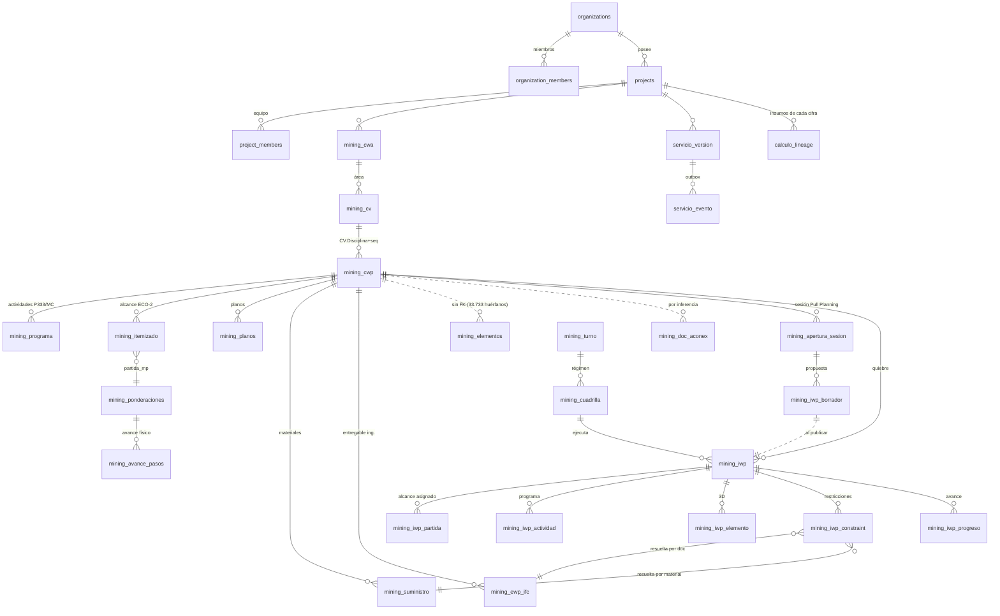

# Modelo de Datos — Hilo Digital

> **Estado:** levantamiento del modelo vigente + brechas de escalabilidad.
> **Fecha:** 2026-08-08. Medido sobre `lsoesbsrlfingfckozsq` (56 tablas `mining_*`, 5 proyectos).
> **Audiencia:** el equipo de desarrollo que industrializará la plataforma.
> **Documento hermano:** [`HISTORIAS_USUARIO.md`](HISTORIAS_USUARIO.md) — la demanda. Este es la
> oferta. El cruce entre ambos está en `HISTORIAS_USUARIO.md` §5.
> **Documento previo:** [`ARQUITECTURA_SERVICIOS.md`](ARQUITECTURA_SERVICIOS.md) define *quién es
> dueño de qué*. Este define *qué hay y cómo se conecta*.

---

## 0. Qué es y qué no es este documento

**Es** el mapa de las entidades reales, sus llaves, sus dueños y las trampas que un desarrollador
nuevo va a pisar. Todo lo que dice está medido contra la base, no supuesto.

**No es** un diccionario de datos columna por columna. Ese lo genera la herramienta
(`npx supabase gen types` ya produce [`src/lib/supabase/types.ts`](../src/lib/supabase/types.ts))
y se desactualiza solo. Aquí va lo que la herramienta **no** puede decir: por qué una tabla
existe, cuál columna sirve de verdad, y qué agregación produce un número plausible y falso.

**Cómo usarlo:** §1–§5 para entender el modelo. §6 antes de tocar un vocabulario. **§7 es la
sección que importa para escalabilidad** — son cuatro brechas concretas con opciones de
solución. §8 son las reglas que deben sobrevivir a cualquier refactor.

---

## 1. Las tres capas

El modelo tiene tres capas con reglas distintas. Confundirlas es el error de arranque más común.

```
┌──────────────────────────────────────────────────────────────────┐
│  CAPA 1 — GOBERNANZA                                             │
│  organizations · organization_members · projects · project_members│
│  Quién existe, a qué empresa pertenece y qué puede ver.          │
│  Regla: es la raíz de la RLS. Todo lo demás cuelga de aquí.      │
├──────────────────────────────────────────────────────────────────┤
│  CAPA 2 — DOMINIO AWP  (56 tablas mining_*)                      │
│  El proyecto de construcción: paquetes, programa, modelo,        │
│  documentos, ejecución.                                          │
│  Regla: 56 de 56 llevan project_id. La llave de negocio es CWP.  │
├──────────────────────────────────────────────────────────────────┤
│  CAPA 3 — CONTRATO DE SERVICIOS                                  │
│  servicio_version · servicio_evento · calculo_lineage            │
│  schemas svc_* (privados) y pub (publicado)                      │
│  Regla: propiedad exclusiva, versión inmutable, consumo por vista│
└──────────────────────────────────────────────────────────────────┘
```

**Estado de cada capa hoy:**

| Capa | Madurez | Evidencia |
|---|---|---|
| 1 — Gobernanza | 🟡 Sirve para aislar empresas, **no** para distinguir personas | §7.1, §7.3 |
| 2 — Dominio AWP | ✅ Sólida y poblada con datos reales | 94.229 elementos, 159 CWP, 1.172 actividades |
| 3 — Contrato | 🟡 Diseñada completa, **1 de 11 servicios migrado** | `recursos` migrado; 2 de 56 tablas con `version_id` |

---

## 2. La llave: el CWP

**Todo se conecta por el CWP.** No es una convención estética: es la decisión de diseño de la que
depende que la plataforma sea una sola fuente de verdad y no once silos con API.

### Anatomía del código

```
312101.C001
│││││└─┴──── secuencia dentro de la disciplina (3 dígitos)
││││└─────── letra de disciplina (C = Civil, S = Estructura, P = Piping, …)
└┴┴┴┴┴────── CV: código de área/centro de valor (6 dígitos)
```

### Cómo se implementa

La FK al CWP es **compuesta**: `(project_id, cwp_id)`. Eso es lo que impide que un paquete de un
proyecto se vincule con datos de otro, y hace innecesario un `uuid` para el CWP —
`mining_cwp` **no tiene columna `id`**.

```sql
FOREIGN KEY (project_id, cwp_id)
  REFERENCES mining_cwp(project_id, cwp_id)
  ON UPDATE CASCADE ON DELETE RESTRICT
```

`ON UPDATE CASCADE` permite renombrar un CWP sin romper los hijos. `ON DELETE RESTRICT` hace que
**borrar un CWP con datos colgando falle** — es exactamente lo que se quiere.

### Quién tiene la FK y quién no

| Tabla | FK al CWP | Regla de borrado | Por qué |
|---|---|---|---|
| `mining_itemizado` | ✔ | RESTRICT | El alcance no puede quedar huérfano |
| `mining_planos` | ✔ | RESTRICT | Ídem |
| `mining_programa` | ✔ | RESTRICT | Ídem |
| `mining_iwp` | ✔ | CASCADE | Un IWP sin su CWP no significa nada |
| `mining_suministro` | ✔ | CASCADE | Ídem |
| `mining_ewp_ifc` | ✔ | CASCADE | Ídem |
| **`mining_elementos`** | ✘ **a propósito** | — | Tiene **33.733 filas apuntando a CWP inexistentes**. Con FK, la carga del modelo sería imposible. |
| **`mining_doc_aconex`** | ✘ | — | El vínculo se resuelve por inferencia y cambia; ver §5.4 |

**No "arreglar" la falta de FK en `mining_elementos`.** El modelo BIM llega con CWP que todavía no
existen en el catálogo, y esa es información válida —es la brecha que el Coordinador BIM tiene que
cerrar—, no un error de integridad. La cobertura se mide, no se impone.

---

## 3. Diagrama de entidades



Las líneas punteadas (`..`) son vínculos **sin FK**: existen en la lógica, no en el motor. Son
exactamente los dos puntos donde la integridad se mide en vez de imponerse.

---

## 4. Catálogo de entidades

Filas al 2026-08-08, todos los proyectos sumados.

### 4.1 Gobernanza

| Entidad | Qué es | Llave | Filas |
|---|---|---|---|
| `organizations` | Empresa cliente. Unidad de aislamiento. | `id`, `slug` | 1 activa (EIMISA) |
| `organization_members` | Quién pertenece a qué empresa. **Es la raíz de la RLS.** | `(organization_id, user_id)` + enum `org_role` | — |
| `projects` | Unidad de cobro y de datos. | `id` | 5 |
| `project_members` | Equipo del proyecto + enum `project_role`. | `(project_id, user_id)` | 3 |

### 4.2 Estructura AWP (servicio `awp` — Control de Proyecto)

| Entidad | Qué es | Filas |
|---|---|---|
| `mining_cwa` | Construction Work Area. | 12 |
| `mining_cv` | Centro de valor / área. Nivel intermedio. | 23 |
| `mining_cwp` | **El paquete. La llave del sistema.** Sin columna `id`. | 159 |
| `mining_programa` | Actividades de programa. **Filtrar SIEMPRE por `fuente`** (§7.5). | 1.172 |
| `mining_programa_relacion` | Predecesoras/sucesoras del programa. | 823 |
| `mining_itemizado` | Alcance contractual ECO-2 por CWP. **La fuente de cantidades.** | 2.524 |
| `mining_ponderaciones` | Bases de M&P: cómo se pondera el avance físico. | 634 |
| `mining_mc` | Memoria de cálculo. **Nunca sumar por CWP** (§7.5). | 997 |
| `mining_pwp` / `mining_swp` / `mining_swp_subsistemas` | Paquetes de adquisición y de sistemas. | 51 / 33 / 36 |
| `mining_hitos`, `mining_partidas`, `mining_bmp_partidas` | Catálogos de apoyo. | 13 / 477 / 74 |

### 4.3 Modelo BIM (servicio `bim` — Coordinación BIM)

| Entidad | Qué es | Filas |
|---|---|---|
| `mining_elementos` | Elementos del modelo. Llave `(project_id, sp3d_moniker)`. **Sin `id` y sin FK al CWP.** | 94.229 |
| `mining_elemento_codigo` | Códigos alternativos por elemento (`externalId`, TAG). | 30.101 |
| `mining_colores_codigo` | Reglas de pintado del visor. | 42 |
| `mining_awp_pid` / `_linea` / `_equipo` | Estructura de piping (P&ID, líneas, equipos). | 31 / 96 / 630 |

### 4.4 Documental (servicio `documental` — Control Documental)

| Entidad | Qué es | Filas |
|---|---|---|
| `mining_planos` | Planos con FK dura al CWP. | 1.867 |
| `mining_doc_aconex` | Documentos de Aconex. **El `Estatus` es el estado del ciclo de vida** que gobierna el gate de liberación. | 1.444 |
| `mining_doc_referencia`, `mining_estudio_aconex` | Documentos de referencia y del estudio. | 69 / 101 |

### 4.5 WorkFace Planning (servicio `ejecucion`)

| Entidad | Qué es | Filas | Nota |
|---|---|---|---|
| `mining_apertura_sesion` | Sesión de Pull Planning sobre un CWP. Índice parcial: **una `ABIERTA` por CWP**. | 2 | |
| `mining_iwp_borrador` | Paquete propuesto, con `partidas` en jsonb. | 0 | Vive en base para sobrevivir al reload y compartirse |
| `mining_iwp` | El paquete de trabajo. `CHECK` de 7 estados. | 4 | |
| `mining_iwp_partida` | **Cantidades asignadas. Lo que se descuenta del banco.** | **0** | ⬜ Ver §7.4 |
| `mining_iwp_actividad` | Vínculo IWP → actividad de programa. | 5 | |
| `mining_iwp_elemento` | Vínculo IWP → elementos 3D. | **0** | ⬜ |
| `mining_iwp_constraint` | Restricciones. `CHECK` de 10 tipos + FK a `ewp_ifc` y `suministro`. | 7 | |
| `mining_iwp_progreso` | Avance declarado. | **0** | ⬜ |
| `mining_avance_pasos` | Pasos de avance según ponderación. | **0** | ⬜ |
| `mining_3wla` / `_restriccion` | Look-ahead trisemanal. | 20 / 7 | Pausado por decisión del dueño |
| `mining_consideraciones` | Consideraciones de departamento (texto libre) que siembran restricciones. | 127 | |

> **Las cuatro tablas en 0 son el ciclo de ejecución completo.** El modelo lo previó; lo que
> falta es la persona que lo alimente (P7, Supervisor de cuadrilla) y su interfaz.

### 4.6 Recursos (servicio `recursos` — ✅ migrado, es el molde)

| Entidad | Qué es | Filas |
|---|---|---|
| `svc_recursos.reporte_diario` | El RD de obra. Dato **real** de terreno. Antes `mining_dotacion`. | 25 |
| `svc_recursos.personal` | Nómina. Antes `mining_personal`. | 11 |
| `svc_recursos.actividad_mapa` | Puente `cod_rd → cwp_id`. **9 códigos sembrados, 0 mapeados.** | 9 |
| `mining_turno` | Regímenes (7×7, 14×14, 6×1). Convierten HH en días y personas. | 25 |
| `mining_cuadrilla` | Cuadrillas tipo. Su capacidad por ciclo define el tamaño objetivo del IWP. | 61 |

Contrato publicado: `pub.recursos_reporte_diario`, `_actividades`, `_hh_por_cwp`,
`_equipos_horas`, `_personal`, `_cuadrillas`, `_cobertura_llave`.

### 4.7 Transversales

| Entidad | Qué es | Filas |
|---|---|---|
| `servicio_version` | Versión por servicio: `draft` / `publicada` / `retirada`. | 2 |
| `servicio_evento` | Outbox de publicaciones. | 0 |
| `calculo_lineage` | **Con qué versiones se calculó cada cifra derivada.** | **0** |
| `mining_cambios_log` | Auditoría de cambios, con FK a `auth.users`. | **178.532** |

---

## 5. Las llaves de cruce

Además del CWP, hay cuatro cruces que sostienen el producto. Cada uno es un punto de falla
silenciosa: cuando no calzan, **no hay error, hay cero filas**.

### 5.1 Programa ↔ Itemizado

```
mining_programa.cod_actividad  =  mining_itemizado.partida_bmp
```

Es el código del programa contractual (`P333-…` en Collahuasi, `A1250` estilo P6 en Spence).

> ⚠️ **`partida_bmp` guarda el código de PROGRAMA, no el de Bases de M&P.** El de M&P va en
> `partida_mp`, columna aparte. El nombre miente; no confundir ni sobreescribir.

### 5.2 Itemizado ↔ Estado de Pago

```
mining_itemizado.partida_mp  =  mining_ponderaciones.item_code / subitem_code
```

Es la cadena que convierte cantidad ejecutada en monto ganado.

### 5.3 La línea de alcance de un CWP

```
llave = (item, partida_bmp)   ← NO solo (item)
```

Un mismo item aparece **una vez por frente físico** (Anillo A / B / C), cada uno con su cantidad.
Agregarlo por `item` a secas **borra los frentes**. Esta llave está implementada en tres lugares
que deben coincidir siempre: `src/lib/cwp-banco.ts`, la vista `v_cwp_banco` y el índice único
`idx_itemizado_project_item_partida`.

> El índice es **único, no constraint** → `ON CONFLICT` no sirve sobre él.

### 5.4 Documento ↔ CWP (por prioridad, no por FK)

Se resuelve en este orden, y **la inferencia por código es el último recurso**:

1. El CWP escrito en Aconex.
2. El que el título nombra (`Procedimiento CWP 312101.F001 Malla a Tierra`).
3. **El vínculo que ya existía.**
4. Área + disciplina del código del documento.

El orden importa: los vínculos previos tienen criterio que el código no alcanza. Los planos de
cajones (disciplina 45, Mecánica) están en `312101.MB001` (calderería), y los de disciplina 47 se
reparten entre `E001`, `EW001` y `T001` según sean equipos, cableado o canalizaciones.

Los CWP de relleno (`SIN-CWP.POR_ASIGNAR`, `*.SIN-CV.SIN-CWP`) **no cuentan como vínculo**.

---

## 6. Vocabularios controlados

Los `CHECK` de la base son parte del modelo, no decoración: **cualquier otro valor revienta el
insert**. Cada uno tiene su fuente única en código.

| Vocabulario | Dónde vive el `CHECK` | Fuente en código | Valores |
|---|---|---|---|
| Estado del IWP | `mining_iwp.status` | `src/lib/iwp-estado.ts` | `PLANIFICADO`, `LISTO_PARA_TRABAJO`, `LIBERADO`, `EN_EJECUCION`, `COMPLETADO`, `CERRADO`, `HOLD` |
| Tipo de restricción | `mining_iwp_constraint.tipo` | `src/lib/constraints.ts` | 10 tipos COAA + `MEDIO_AMBIENTE` |
| Severidad | `mining_iwp_constraint.severidad` | `src/lib/constraints.ts` | `alta`, `media`, `baja` |
| Estado de sesión | `mining_apertura_sesion.estado` | — | `ABIERTA`, `PUBLICADA`, `DESCARTADA` |
| Estado de versión | `servicio_version.estado` | `src/lib/servicios.ts` | `draft`, `publicada`, `retirada` |
| Origen de apertura | `mining_iwp.origen_apertura` | — | `manual`, `asistente` |
| Módulos | *(sin CHECK, jsonb)* | `src/lib/modules.ts` | 14 `ModuleKey` |

### La máquina de estados del IWP

```
PLANIFICADO → LISTO_PARA_TRABAJO → LIBERADO → EN_EJECUCION → COMPLETADO → CERRADO
                                                    ↕
                                                  HOLD
```

Dos reglas que **el modelo debe hacer cumplir, no la UI**:

- **`LISTO_PARA_TRABAJO` lo calcula el servidor.** `mining-iwp-constraint` recalcula el semáforo
  cada vez que una restricción cambia y sube el paquete cuando las pendientes llegan a cero.
  Declararlo a mano sería mentirle al backlog.
- **`LIBERADO` exige cero restricciones abiertas.** Regla del estándar COAA, validada en el
  `PATCH` de `mining-iwp` (`puedeTransicionar`). El botón de la UI solo se anticipa para no
  ofrecer algo que va a fallar.

### ⚠️ Vocabulario duplicado — decidir antes de crecer

La base tiene **seis tipos `enum` que ninguna columna usa**:

| Enum huérfano | Valores | Conflicto |
|---|---|---|
| `constraint_type` | `ENGINEERING`, `MATERIALS`, `EQUIPMENT`, `LABOR`, `SAFETY`, `PREREQUISITE` | **Compite con el `CHECK` en español de `mining_iwp_constraint.tipo`** |
| `constraint_status` | `OPEN`, `IN_PROGRESS`, `CLOSED` | Ídem |
| `cde_status` | `WIP`, `SHARED`, `PUBLISHED`, `ARCHIVED` | Estados CDE ISO 19650, nunca cableados |
| `deliverable_type` | `DRAWING`, `SPECIFICATION`, `BIM_MODEL`, … | Sin tabla que lo use |
| `tidp_status` | `DRAFT`, `CURRENT`, `SUPERSEDED` | Compite con `servicio_version.estado` |
| `tidp_discipline` | 12 departamentos en español | **Es la lista de personas que §7.1 necesita** |

Son restos de un diseño ISO 19650 que no se cableó. Dos consecuencias prácticas:

1. **Un desarrollador nuevo va a encontrar `constraint_type` y creer que es el catálogo vigente.**
   No lo es. El vivo es el `CHECK` + `src/lib/constraints.ts`.
2. **`tidp_discipline` no hay que inventarla: ya está.** Es el enum que §7.1 propone usar.

**Decisión pendiente:** o se cablean o se eliminan. Dejarlos es acumular deuda de vocabulario, que
es la más cara de pagar porque nadie sabe cuál era la buena.

**Segunda duplicación, en jsonb:** `projects.role_permissions` habla de módulos
`4d, awp, bim, cwp, team, roles, documents`, que **no existen** en `ModuleKey`
(`panel, mineria, apertura, planificacion, …`). Recomendación: sobrevive `ModuleKey`, porque es
el que la navegación y el gating del layout ya leen.

---

## 7. Lo que hoy no escala

Cuatro brechas. Cada una está medida, no supuesta, y trae opciones con su costo.

### 7.1 El departamento de una persona no existe en el modelo

**Medición.** El modelo reconoce 11 departamentos como dueños de restricciones
(`src/lib/constraints.ts`, campo `depto`) y 12 en el enum `tidp_discipline`. La tabla
`project_members` tiene **3 valores posibles**: `admin`, `editor`, `viewer`.

**Consecuencia.** Un prevencionista y un planificador son la misma fila. No hay forma de:
- filtrar la bandeja de restricciones por "las mías";
- notificar al departamento correcto;
- exigir que solo Calidad cierre una restricción `CALIDAD`;
- medir días de cierre por departamento.

Bloquea 6 personas (P8–P13) y ~10 historias.

**Opciones**

| | Cómo | Costo | Riesgo |
|---|---|---|---|
| **A** *(recomendada)* | `alter table project_members add column departamento tidp_discipline;` Reusa el enum que ya existe. | Bajo. Una columna, un `select` en la invitación, un filtro en cada bandeja. | Una persona con dos sombreros necesita dos filas. |
| **B** | Tabla `project_member_departamento` (N:M). | Medio. | Sobre-modelado para el 95% de los casos. |
| **C** | Extender el enum `project_role` con roles funcionales. | Bajo aparente. | **Mala.** Mezcla los dos ejes: `role` responde *qué puede tocar*, no *de qué responde*. Se paga al primer prevencionista que además sea viewer. |

**Recomendación: A.** Es una columna, reusa vocabulario existente y mantiene los dos ejes
separados. Si algún día una persona necesita dos departamentos, migrar de A a B es mecánico.

### 7.2 El dato no sabe quién lo dejó ni cuándo

**Medición sobre las 56 tablas `mining_*`:**

| Columna | Tablas que la tienen |
|---|---|
| `project_id` | **56 / 56** ✅ |
| `cwp_id` | 17 |
| `created_at` | 13 |
| `updated_at` | 5 |
| `updated_by` | **2** |
| `created_by` | **0** |

**Consecuencia.** Con una persona cargando por script, funciona. Con 16 personas escribiendo
—que es lo que este ejercicio de historias propone— no hay forma de responder *"¿quién puso este
dato y cuándo?"* sobre casi ninguna tabla. Bloquea HU-BIM-03, HU-DEP-03, HU-SUP-02 y cualquier
auditoría del mandante.

**Matiz importante:** `mining_cambios_log` tiene **178.532 filas** con FK a `auth.users`. La
auditoría existe; lo que falta es (a) que cubra todas las tablas de escritura humana y (b) que
alguna persona tenga pantalla para leerla.

**Recomendación.** No agregar las cuatro columnas a las 56 tablas — la mayoría se puebla por
carga masiva y no gana nada. Agregarlas **solo donde escribe una persona**:

```
mining_iwp · mining_iwp_partida · mining_iwp_constraint · mining_iwp_progreso
mining_iwp_borrador · mining_apertura_sesion · mining_cwp_ficha
mining_elementos (updated_by ya existe) · mining_doc_aconex · mining_consideraciones
```

Con `default auth.uid()` en `created_by`, el trigger sale gratis y el código de carga no cambia.

### 7.3 El mandante no cabe en el multi-tenant

**Medición.** `projects.organization_id` es una FK simple, `not null`. Toda la RLS `mining_*` usa
la misma política —*"Users can access mining data in their orgs"*— que autoriza vía
`organization_members`.

**Consecuencia.** Un usuario del mandante **o entra a la organización del contratista y ve todo
—incluidos costos internos, dotación y el resto del portafolio— o no ve nada.** No hay punto
medio. Bloquea a P15 entero (4 historias).

**Opciones**

| | Cómo | Costo | Nota |
|---|---|---|---|
| **A** | Rol `external_viewer` en `project_role` + política RLS que restrinja por tabla. | Bajo | **Frágil:** cada tabla nueva es una oportunidad de filtrar datos por olvido. |
| **B** *(recomendada)* | Tabla `project_acceso_externo (project_id, organization_id, alcance jsonb)`. La RLS pasa a mirar *"¿esta org tiene acceso a este proyecto?"* en vez de *"¿es la dueña?"*. | Medio | El mandante mantiene su propia organización. Escala a ITO, auditor, subcontratista. |
| **C** | Proyecto espejo con datos replicados. | Alto | Dos fuentes de verdad. Contradice el principio maestro. |

**Recomendación: B.** Es la única que no crece en complejidad con cada tabla nueva, y modela la
realidad: **el mandante es otra empresa, no un empleado con menos permisos.** Es también la que
abre el modelo de negocio de vender acceso al mandante.

> Es un cambio en la raíz de la RLS y toca las 56 tablas. Hacerlo **antes** de que haya varios
> clientes en producción, no después.

### 7.4 El versionado está diseñado y a un 9% de aplicación

**Medición.** 1 servicio migrado de 11. 2 de 56 tablas con `version_id`. `calculo_lineage` con 0
filas. La regla 7 de `ARQUITECTURA_SERVICIOS.md` §11 —*"todo cálculo derivado escribe su
lineage"*— no la cumple ningún cálculo.

**Consecuencia.** El Estado de Pago no es reproducible. Cuando el mandante discuta una cifra tres
meses después, la respuesta sigue siendo *"así salió el sistema"*. Es la brecha con más valor
comercial de las cuatro.

**Recomendación.** Seguir el orden de `ARQUITECTURA_SERVICIOS.md` §12 (Etapa 3: `awp` y `bim`,
que son los de más consumidores), pero **adelantar `calculo_lineage`**: se puede empezar a
escribir hoy con las versiones que ya existen, sin esperar a migrar ningún servicio. Es barato y
desbloquea HU-CON-02 y HU-MAN-03.

### 7.5 Trampas de agregación (el modelo tiene minas)

No son brechas de diseño: son propiedades del dato que **producen números plausibles y falsos**.
Un desarrollador nuevo las va a pisar. Están aquí porque ninguna herramienta las documenta.

| Trampa | Qué pasa | Regla |
|---|---|---|
| **Paginar sin `ORDER BY`** | PostgREST devuelve filas repetidas y se salta otras. Medido: `mining_elementos` daba 15.000 "duplicados" y 41.000 elementos "faltantes" **que no existían**. | **Todo `.range()` va con `.order()`** por columna estable. |
| **Sumar `mining_mc.hh_item` por CWP** | La MC repite el total del item en cada actividad que lo toca. `312101.S001`: 225.666 HH contra 55.606 reales. | Las cantidades por CWP salen de `mining_itemizado` filtrado por `cwp_id`. |
| **Sumar `HH_Proporcional` del 4D** | Mismo patrón. Da 1.178.499.168 HH para un CWP con 56.119 de presupuesto. | Nunca sumar. Es un agregado repetido. |
| **Agregar el alcance por `item`** | Borra los frentes físicos (Anillo A/B/C). | La llave es `(item, partida_bmp)`. Ver §5.3. |
| **No filtrar `mining_programa.fuente`** | Conviven dos programas: `P333` (contractual del mandante, el único que lee la app) y `MC` (construcción propio, 206 actividades, al que apunta el 4D). | `.eq('fuente','P333')` **siempre**. Al cargar un proyecto nuevo, poner `fuente`. |
| **Filtrar elementos por `disciplina`** | En el Puerto esa columna viene vacía; la lista real está en `disciplina_modelo`. Un selector armado con una y filtrado con la otra da **cero filas sin ningún error**. | Resolver primero cuál columna trae valores: `disciplina` → `disciplina_modelo` → `especialidad_cod`. |
| **Contar con `select('id')`** | `mining_elementos` y `mining_cwp` **no tienen columna `id`**. | `select('*', {count:'exact', head:true})`. |
| **Insert por lote con claves distintas** | PostgREST usa la unión de las claves de todas las filas. Una fila sin `editado` viaja con `NULL` explícito y revienta el `NOT NULL` en vez de tomar el `DEFAULT`. | Todas las filas de un lote, con el mismo juego de claves. |
| **Códigos `SIN-*` contados como dato** | Son placeholders de UI para "por asignar". Sin descontarlos, el informe de conformidad diría 100% de cobertura de CWP con 33.733 filas apuntando a paquetes inexistentes. | Descontarlos en toda métrica de cobertura. |
| **Vistas sin `security_invoker`** | Se saltan la RLS y exponen datos de otra empresa. | Toda vista lleva `with (security_invoker = on)`. Sin excepción. |

---

## 8. Reglas de modelado

Las que deben sobrevivir a cualquier refactor. Se hacen cumplir en revisión de código.

1. **Toda tabla de dominio lleva `project_id`.** 56 de 56 hoy. Es lo que hace posible el
   multi-tenant y no se negocia.
2. **Toda entidad que se pueda atribuir a un paquete lleva `cwp_id`,** o una columna que mapee a
   CWP. Un servicio que publica sin CWP sigue siendo un silo, solo que con API.
3. **La FK al CWP es compuesta `(project_id, cwp_id)`.** Nunca por `uuid`.
4. **Un vocabulario cerrado vive en un `CHECK` y tiene un archivo `.ts` como fuente única.**
   Nadie escribe un `status` a mano ni duplica la lista en un `<select>`.
5. **Ninguna transición de estado se decide en el cliente.** El cliente se anticipa para no
   ofrecer lo que va a fallar; el servidor decide.
6. **Toda vista lleva `security_invoker = on`.**
7. **Ningún servicio lee el schema `svc_*` de otro. Solo `pub`.**
8. **Una versión `publicada` no se edita. Se publica una nueva. Nada se borra: se retira.**
9. **Todo cálculo derivado escribe su `calculo_lineage`.**
10. **Antes de crear una tabla, encontrarle la historia de usuario.** Si no aparece en
    `HISTORIAS_USUARIO.md` §5, es dato muerto: alguien va a tener que mantenerlo, versionarlo y
    migrarlo sin que nadie lo use.

---

## 9. Orden recomendado de trabajo

Ordenado por *cuánto desbloquea dividido por cuánto cuesta*, no por urgencia percibida.

| # | Qué | Desbloquea | Costo | Sección |
|---|---|---|---|---|
| 1 | `project_members.departamento` (enum existente) | 6 personas, ~10 historias | Bajo | §7.1 |
| 2 | `created_by` / `updated_by` en las ~10 tablas de escritura humana | Auditoría, HU-BIM-03, HU-DEP-03 | Bajo | §7.2 |
| 3 | Resolver el vocabulario duplicado (cablear o eliminar los 6 enums) | Evita deuda que crece sola | Bajo | §6 |
| 4 | Empezar a escribir `calculo_lineage` | HU-CON-02, HU-MAN-03 | Bajo | §7.4 |
| 5 | Interfaz de parte diario + `mining_iwp_partida` | **Cierra el ciclo hasta el Estado de Pago.** P7 entero. | Alto | §4.5 |
| 6 | `project_acceso_externo` y RLS por acceso | P15 entero; abre venta al mandante | Medio-alto | §7.3 |
| 7 | Migrar `awp` y `bim` a schema propio con versión | HU-AWP-03/04 | Alto | §7.4 |

**Los cuatro primeros son de bajo costo y hacen del modelo algo que soporta 16 personas en vez de
una.** Conviene hacerlos antes de que haya varios clientes en producción, porque el 6 toca la
raíz de la RLS y el 1 cambia una tabla que va a tener muchas más filas el próximo año.
